# Hey, I'm Brad Asher &#128075;

### Computer Science student at the University of Washington &middot; Systems, data, and agentic AI

## About me

I'm an incoming **Computer Science Direct to Major** freshman in the **Interdisciplinary Honors Program** at the University of Washington. I enjoy turning difficult problems into dependable systems&mdash;especially at the intersection of backend data architecture, cloud infrastructure, and autonomous AI agents.

- &#128269; Building [AWS AI File Analyzer](https://github.com/htzhang2/aws-file-analyzer) with React, .NET 8, and Azure SQL
- &#129504; Exploring **agentic AI**, **MCP**, and workflow orchestration with **n8n**
- &#129514; Prototyped research tools with the UW UbiComp Lab; currently a MergeWorks AI Co-Builder Fellow
- &#129309; Open to AI projects, research collaborations, and internship opportunities
- &#128196; [View my r&eacute;sum&eacute;](https://drive.google.com/file/d/1dsj8OMIERZ3fkSp0wQWqz9o0P4k4KfF7/view?usp=sharing)

## What I work with

## Featured focus

| Area | What I'm interested in |
| --- | --- |
| **AI agents** | Practical agent workflows, Model Context Protocol, and useful automation |
| **Backend systems** | APIs, data architecture, cloud services, and resilient integrations |
| **Applied research** | Building and testing tools that connect people with emerging technology |

## Let's connect

 
 

*"Build thoughtfully. Learn relentlessly. Serve with purpose."*

## GitHub activity

