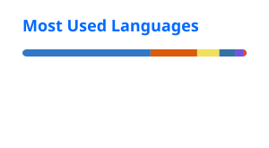

# Hey, I'm Brad Asher &#128075;

### Computer Science student at the University of Washington &middot; Systems, data, and agentic AI

## About me

I'm an incoming **Computer Science Direct to Major** freshman in the **Interdisciplinary Honors Program** at the University of Washington. I enjoy turning difficult problems into dependable systems&mdash;especially at the intersection of backend data architecture, cloud infrastructure, and autonomous AI agents.

- &#128188; **[MergeWorks Financial Due Diligence Engine](https://github.com/BradshawAsher/MergeWorks-Financial-Due-Diligence)** &mdash; Flagship autonomous M&A intelligence platform automating Pre-LOI Valuation Discovery & Post-LOI Deal Negotiation with multi-modal VDR ingestion, deterministic accounting reconciliation, and n8n cloud agent orchestration *(React 19, TypeScript, PostgreSQL, Supabase, Cloudflare, n8n)*
- &#127912; **[AI Art Companion](https://github.com/BradshawAsher/ai-art-companion)** &mdash; Neurodivergent-accessible visual art critique & learning companion built with my brother, featuring multi-tiered Google Gemini vision/text fallback chains, interactive canvas critiques, and sensory-friendly UX *(React, Bun, Supabase, Tailwind CSS)*
- &#128269; **[AWS AI File Analyzer](https://github.com/BradshawAsher/aws-file-analyzer)** &mdash; Full-stack intelligent document analysis platform with automated metadata extraction *(React, C# / .NET 8, Azure SQL, AWS)*
- &#129504; Exploring **agentic AI**, **Model Context Protocol (MCP)**, and workflow orchestration with **n8n**
- &#129514; Prototyped research tools with the UW UbiComp Lab; currently a MergeWorks AI Co-Builder Fellow
- &#129309; Open to AI projects, research collaborations, and internship opportunities
- &#128196; [View my r&eacute;sum&eacute;](https://drive.google.com/file/d/1dsj8OMIERZ3fkSp0wQWqz9o0P4k4KfF7/view?usp=sharing)

## What I work with

## Featured focus

| Area | What I'm interested in |
| --- | --- |
| **Agentic AI & LLMs** | Multi-model fallback routing, Model Context Protocol (MCP), autonomous diligence agents, and n8n workflow orchestration |
| **Backend & Cloud Systems** | Deterministic financial math engines, high-throughput VDR pipelines, Supabase / PostgreSQL, and edge caching |
| **Applied Research & Accessibility** | Neurodivergent-adapted interfaces, human-in-the-loop AI workflows, and multimodal assistive tools |

## Let's connect

 
 

*"Build thoughtfully. Learn relentlessly. Serve with purpose."*

## GitHub activity

